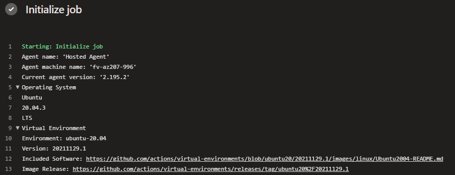

# Pre image updates

To add custom meta data to self-hosted agents you make changes to the pre image scripts during image building. To review this data, you can see it during pipeline runs. This is usefule when trying to identiy exactly what image is being used.

An example of existing pipeline run showing meta data

There are two scripts that make this change:

- [_preimagedata.sh](/vm-images/images/linux/scripts/installers/_preimagedata.sh) for Linux agents
- [_Update-ImageData.ps1](/vm-images/images/win/scripts/Installers/_Update-ImageData.ps1) for Windows agents
