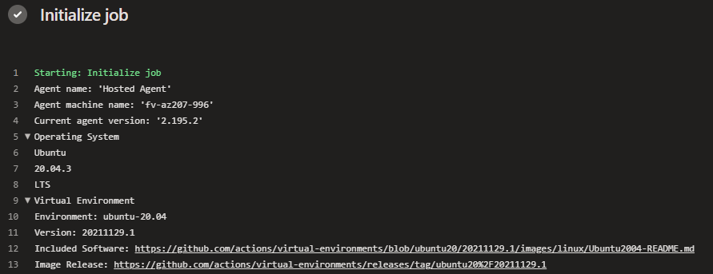

# actions/virtual-environments Updates

Basic steps:

1. Create topic branch
2. Create Git subtree in .virtual-environments directory
3. Compare /.virtual-environments/images to /vm-images/images directory
4. Use diff tool to compare artifacts between the two directories to find new updates and changes
5. Test
6. Delete /.virtual-environments
7. Open Pull Request

> See [tips](./docs/tips.md#git-subtree) to get the common Git CLI commands

The taret directory is [vm-images](vm-images). This directory aligns with the repo [images](https://github.com/actions/virtual-environments/tree/main/images) directory.

## Pre image updates

### [preimagedata](vm-images/images/linux/scripts/preimagedata.sh)

This script addes meta data to the image so the agent runner can output it during the `Initialize job` step in a Job. This is available for hosted images, but is also very useful for self-hosted images. The following is an example of the output that's in the metadata file and how it's shown during a run.

